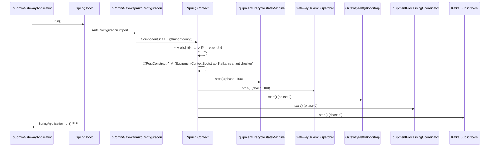

# 01. 구동 순서 안내서 (Startup Sequence)

## 문서 목적

이 문서는 `tc-comm-gateway-app`가 실행될 때 어떤 컴포넌트가 어떤 순서로 준비되고 시작되는지 설명합니다.

초급 개발자가 먼저 이해해야 할 핵심은 다음 두 가지입니다.

1. 앱 모듈(`apps/tc-comm-gateway-app`)은 진입점/조립 역할이 중심입니다.
2. 실제 통신 동작은 `SmartLifecycle` 컴포넌트들이 phase 순서에 따라 올라오면서 시작됩니다.

관련 문서:

1. Bean 상세: [`02-context-bean-map.md`](./02-context-bean-map.md)
2. 라이프사이클 상태머신: [`03-lifecycle-state-machine-overview.md`](./03-lifecycle-state-machine-overview.md)

주의:

1. 이 문서의 ACTIVE/PASSIVE 설명은 gateway 기준 해석을 따릅니다.
2. 상세 생명주기 문서(`04`, `05`)도 gateway 기준 파일명/내용으로 정리되어 있습니다.

## 먼저 보는 핵심 파일

1. 앱 진입점
   - `apps/tc-comm-gateway-app/src/main/java/com/nori/tc/apps/commgateway/TcCommGatewayApplication.java`
2. 자동구성
   - `libs/comm/starter/tc-comm-gateway-starter/src/main/java/com/nori/tc/comm/gateway/starter/autoconfigure/TcCommGatewayAutoConfiguration.java`
3. 자동구성 등록
   - `libs/comm/starter/tc-comm-gateway-starter/src/main/resources/META-INF/spring/org.springframework.boot.autoconfigure.AutoConfiguration.imports`
4. 핵심 설정 클래스
   - `libs/comm/starter/tc-comm-gateway-starter/src/main/java/com/nori/tc/comm/gateway/starter/autoconfigure/GatewayCommConfiguration.java`
   - `libs/comm/starter/tc-comm-gateway-starter/src/main/java/com/nori/tc/comm/gateway/starter/autoconfigure/GatewayProcessingConfiguration.java`

## 1. 시작 전체 흐름 요약

한 줄 요약:

`Spring Boot 시작 -> AutoConfiguration 로딩 -> Bean 생성/초기화 -> SmartLifecycle 시작 -> 컨텍스트 기동 완료`

조금 더 풀어서 보면:

1. `TcCommGatewayApplication.main()`에서 Spring Boot 시작
2. starter의 `AutoConfiguration`가 로딩되어 gateway Bean들이 등록됨
3. 프로퍼티 바인딩/검증 + `@PostConstruct` 초기화 수행
4. `SmartLifecycle` 컴포넌트들이 phase 순서대로 시작됨
5. `TcCommGatewayApplication`에서 기동 완료 로그 출력 (`SpringApplication.run(...)` 반환 이후)

## 2. 앱 진입점 단계

### 2-1. `TcCommGatewayApplication`의 역할

`TcCommGatewayApplication`는 전형적인 Spring Boot 진입점입니다.

중요 포인트:

1. 실제 통신 로직이 거의 없습니다.
2. 시작/종료 로그 성격이 강합니다.
3. "기능이 어디 있지?"라는 질문의 답은 `libs/comm/*`에 있습니다.

초급 개발자가 여기서 멈추면 안 됩니다. 이 클래스는 조립의 시작점일 뿐입니다.

### 2-2. `application.yaml` 로딩과 외부 설정 import

파일:

- `apps/tc-comm-gateway-app/src/main/resources/application.yaml`

핵심 특징:

1. `spring.main.web-application-type: none`
   - 웹 서버 기반 앱이 아니라 백그라운드 프로세스 성격
2. `spring.config.import`로 외부 properties 로딩
   - `config/tc-db.properties`
   - `config/tc-messaging.properties`
   - `config/tc-redis.properties`
   - `config/tc-comm.properties`
   - `config/tc-log.properties`

초급 개발자 관점에서 중요한 점:

1. 실제 운영 설정 대부분은 `config/*.properties`에 있습니다.
2. `application.yaml`만 보고 설정이 충분하다고 판단하면 안 됩니다.

## 3. Starter 기반 AutoConfiguration 단계

### 3-1. 앱의 `build.gradle.kts`가 중요한 이유

파일:

- `apps/tc-comm-gateway-app/build.gradle.kts`

이 파일에서 `tc-comm-gateway-starter`를 의존성으로 추가하면, 앱은 직접 모든 Bean을 등록하지 않아도 gateway 관련 기능을 가져올 수 있습니다.

실무 관점에서 장점:

1. 앱 모듈이 단순해짐
2. gateway 기능 재사용 가능
3. 코어/어댑터 변경이 앱 코드 변경 없이 반영되기 쉬움

### 3-2. AutoConfiguration 등록 파일

Spring Boot는 다음 파일을 읽어 자동구성 클래스를 찾습니다.

- `libs/comm/starter/tc-comm-gateway-starter/src/main/resources/META-INF/spring/org.springframework.boot.autoconfigure.AutoConfiguration.imports`

여기에 gateway 자동구성 클래스가 등록됩니다.

참고 (현재 코드 기준):

1. `AutoConfiguration.imports`에는 `com.nori.tc.comm.gateway.starter.TcCommGatewayAutoConfiguration`가 등록되어 있습니다.
2. 실제 소스 파일 위치는 `.../starter/autoconfigure/TcCommGatewayAutoConfiguration.java` 입니다.

### 3-3. `TcCommGatewayAutoConfiguration` 동작 요약

역할:

1. `@ComponentScan(basePackages = "com.nori.tc.comm")`
   - core/adapter의 `@Component`, `@Service` 등을 스캔해서 Bean 등록
2. `@Import(...)`
   - `GatewayCommConfiguration`
   - `GatewayProcessingConfiguration`

즉, 이 단계에서 gateway의 핵심 구성 요소가 Spring Context로 들어옵니다.

## 4. Bean 생성/초기화 단계 (컨텍스트 조립)

이 단계는 "실제 런타임 시작" 전 준비 단계입니다.

주요 내용:

1. 프로퍼티 클래스 바인딩 및 유효성 검증
2. `@Bean` 생성
3. 컴포넌트 스캔 Bean 생성
4. `@PostConstruct` 실행

### 4-1. 프로퍼티 바인딩과 검증

`GatewayCommConfiguration`에서 활성화되는 주요 설정 클래스:

1. `GatewayRuntimeProperties`
2. `GatewayLifecycleProperties`
3. `GatewayHsmsProperties`
4. `GatewaySocketProperties`
5. `GatewayKafkaTopicProperties`
6. `GatewayKafkaClientProperties`
7. `GatewayKafkaShardProperties`
8. `GatewayUiTaskPolicyProperties`
9. `GatewayRedisProperties`
10. `GatewayPublishPolicyProperties`
11. `GatewayNettyProperties`
12. `GatewayObservabilityProperties`
13. `GatewaySocketPluginRuntimeProperties`

이때 잘못된 값이 있으면 애플리케이션 시작 중에 예외가 발생할 수 있습니다.

예시:

1. timeout <= 0
2. partition 수 불일치
3. 필수 문자열 누락
4. queue size 잘못된 범위

### 4-2. 코어 Bean 생성

`GatewayCommConfiguration`, `GatewayProcessingConfiguration`에서 다음과 같은 핵심 Bean들이 만들어집니다.

1. 공통/정책/파이프라인
   - `ClockPort`, `TraceIdGeneratorPort`, `PublishPolicy`, `SocketTypeRegistry`, `HsmsInboundPipeline`, `SocketInboundPipeline`
2. 처리 계층
   - `EquipmentChannelRegistry`, `EquipmentMailboxRegistry`, `OutboundSenderPort`, `InboundPipelinePort`, `RouteAndPublishUseCase`, `EqpSequentialProcessor`

이 Bean들은 이후 Netty/Kafka/UI 경로에서 공통으로 사용됩니다.

### 4-3. `@PostConstruct` 초기화 컴포넌트

대표 예시:

1. `EquipmentContextBootstrap`
   - 장비 프로파일을 읽어 `EquipmentContextRegistry`에 적재
2. `GatewayKafkaOperationalInvariantChecker`
   - Kafka topic/partition 불변조건 검증

`EquipmentContextBootstrap`의 초기 상태 설정 규칙:

1. `enabled = true` -> `desiredState = STARTED`, `runtimeState = DISCONNECTED`
2. `enabled = false` -> `desiredState = ENDED`, `runtimeState = REGISTERED`

중요:

이 시점은 "상태 등록"이지 "실제 connect/listener 시작 완료"가 아닙니다.

## 5. `SmartLifecycle` 시작 단계 (실질적인 런타임 시작)

Spring은 컨텍스트가 준비되면 `SmartLifecycle` Bean을 `phase` 순서로 시작합니다.

규칙:

1. 숫자가 낮을수록 먼저 시작
2. 같은 phase 내 순서는 절대 순서를 강하게 가정하면 안 됨

## 5-1. 주요 컴포넌트의 phase 정리

확인된 핵심 phase:

1. `EquipmentLifecycleStateMachine` -> `-100`
2. `GatewayUiTaskDispatcher` -> `-100`
3. `GatewayNettyBootstrap` -> `0`
4. `EquipmentProcessingCoordinator` -> `0`
5. Kafka subscribers (`AbstractPolicyDrivenKafkaConsumerLifecycle` 기반) -> `0`

### 왜 이 순서가 중요한가?

1. 상태머신이 먼저 떠야 이후 START/END/채널 이벤트를 안전하게 받을 수 있음
2. UI dispatcher가 먼저 떠야 UI Kafka 메시지의 비즈니스 처리 경로가 준비됨
3. Netty/Kafka/Processor는 그 다음에 실제 입출력을 시작

## 5-2. `EquipmentLifecycleStateMachine.start()`

상태머신은 장비별 이벤트 직렬 처리를 위한 worker pool / timeout scheduler를 준비합니다.

중요한 이유:

1. 이후 Netty bind/unbind에서 `CHANNEL_CONNECTED`, `CHANNEL_DISCONNECTED` 이벤트가 들어옴
2. UI START/END 요청도 여기로 들어옴
3. timeout/failure 판정도 여기서 수행됨

즉, 가장 먼저 준비되어야 하는 "판정 엔진"입니다.

## 5-3. `GatewayUiTaskDispatcher.start()`

UI 이벤트 Kafka subscriber 자체는 phase 0이지만, 실제 UI task 처리의 핵심 dispatcher는 phase -100으로 먼저 준비됩니다.

장점:

1. Kafka poll thread가 바로 복잡한 비즈니스 처리에 들어가지 않음
2. `eqpId` 기준 mailbox 직렬 처리 구조가 먼저 준비됨

## 5-4. `GatewayNettyBootstrap.start()`

`GatewayNettyBootstrap`는 통신 런타임의 중심입니다.

시작 시 주요 동작:

1. Netty boss/worker event loop 생성
2. reconnect scheduler 생성
3. `EquipmentContextRegistry` 스냅샷 조회
4. PASSIVE SOCKET 공유 listener 제약 검증 (포트/소켓타입 충돌 fail-fast)
5. enabled 장비 런타임 시작 시도 (`startEnabledRuntimesFromContextRegistry()`)

초급 개발자 포인트:

1. 부팅 후 "왜 어떤 장비는 바로 동작하려고 하나요?" -> enabled 장비 자동 시작 시도 때문입니다.
2. gateway 기준 ACTIVE/PASSIVE에 따라 내부 처리 경로가 다릅니다.

## 5-5. `EquipmentProcessingCoordinator.start()`

장비별 mailbox를 실제로 실행하는 코디네이터입니다.

역할:

1. mailbox execution runtime 시작
2. retry scheduler 생성
3. inbound/outbound drain 작업 준비

`GatewayIngressService`가 큐에 넣은 작업을 실제로 소비하는 실행 엔진으로 이해하면 됩니다.

## 5-6. Kafka subscriber 시작

예시:

1. `GatewayUiEventKafkaSubscriber` (`tc.ui.events`)
2. `GatewayEqpCommandKafkaSubscriber` (`tc.eqp.commands`)

이 단계에서 Kafka poll 루프가 시작됩니다.

중요한 점:

1. subscriber는 계약 검증/디스패치 중심
2. 실제 처리는 상태머신/디스패처/command dispatcher/processing service로 위임

## 6. 컨텍스트 기동 완료 단계 (현재 별도 `ApplicationRunner` 없음)

현재 `tc-comm-gateway-app`에는 별도 `ApplicationRunner` 구현이 없습니다.

의미:

1. 실제 통신 런타임 시작의 핵심은 이미 `SmartLifecycle` 단계에서 수행됩니다.
2. 앱 레벨에서는 `TcCommGatewayApplication`의 시작/기동 완료 로그가 기본 관측 포인트입니다.
3. 향후 운영/점검용 훅이 필요하면 `ApplicationRunner`를 추가할 수 있습니다.

초급 개발자 포인트:

`ApplicationRunner`가 없어도 Netty/Kafka/처리 런타임 시작에는 문제가 없습니다. 핵심은 `SmartLifecycle` 컴포넌트들입니다.

## 7. 전체 시퀀스 다이어그램

## 8. 시작 실패/이상 동작 시 확인 순서

아래 순서로 보면 원인 추적이 빠릅니다.

1. 프로퍼티 바인딩/검증 실패 여부
   - 필수 값 누락, 잘못된 범위
2. `GatewayKafkaOperationalInvariantChecker` 실패 여부
   - topic 존재, partition 수, ownedPartitions 범위
3. `GatewayNettyBootstrap` fail-fast 여부
   - PASSIVE SOCKET 공유 listener 제약 위반
4. `SmartLifecycle` start 단계 예외 여부
   - 어떤 클래스에서 start 예외가 났는지 로그 확인
5. 부팅 직후 enabled 장비 start 시도 실패 로그
   - ACTIVE outbound connect 실패, PASSIVE listener 생성 실패 등

## 9. 초급 개발자 FAQ

### Q1. `enabled=true` 장비가 있는데 왜 부팅 후 `CONNECTED`가 아닌가요?

`enabled`는 "원하는 상태"입니다. 실제 `CONNECTED`는 Netty connect/listener 시작 + bind 성공 이벤트까지 완료되어야 됩니다.

### Q2. 별도 `ApplicationRunner`가 없으면 문제 아닌가요?

문제 아닙니다. 이 프로젝트의 실제 시작 동작 핵심은 `SmartLifecycle` 컴포넌트들이고, `ApplicationRunner`는 필요할 때만 앱 레벨 훅으로 추가하면 됩니다.

### Q3. phase가 같으면 순서를 신경 안 써도 되나요?

같은 phase 내에서는 절대 순서를 가정하지 않는 설계가 중요합니다. 이 프로젝트는 핵심 선행 조건을 `-100` / `0` 분리로 해결하고 있습니다.

## 10. 다음 문서 안내

다음 문서 [`02-context-bean-map.md`](./02-context-bean-map.md)에서는 "누가 어디서 생성되고 무엇을 하는지"를 Bean 기준으로 정리합니다.
