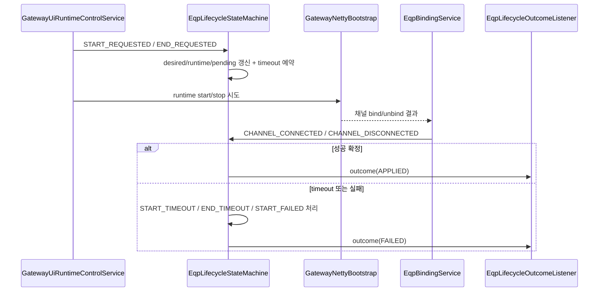

# 03. Lifecycle State Machine 공통 안내서

## 문서 목적

이 문서는 `EqpLifecycleStateMachine`를 중심으로 장비 라이프사이클의 공통 개념을 설명합니다.

ACTIVE/PASSIVE 상세 문서(`04`, `05`)를 읽기 전에 이 문서를 먼저 읽어야 하는 이유는 다음과 같습니다.

1. 두 문서 모두 같은 이벤트/상태/timeout/pending 개념을 사용합니다.
2. START/END의 최종 성공/실패 판정은 상태머신에서 수행됩니다.
3. Netty 경로와 UI 경로가 상태머신에서 만나기 때문입니다.

관련 파일:

1. `libs/comm/tc-comm-gateway-core/src/main/java/com/nori/tc/comm/gateway/lifecycle/EqpLifecycleStateMachine.java`
2. `libs/comm/tc-comm-gateway-core/src/main/java/com/nori/tc/comm/gateway/lifecycle/EqpLifecycleEvent.java`
3. `libs/comm/tc-comm-gateway-core/src/main/java/com/nori/tc/comm/gateway/lifecycle/EqpLifecycleTransitionGuard.java`
4. `libs/comm/tc-comm-gateway-core/src/main/java/com/nori/tc/comm/gateway/lifecycle/EqpLifecycleOutcome.java`
5. `libs/comm/tc-comm-gateway-core/src/main/java/com/nori/tc/comm/gateway/lifecycle/EqpLifecycleOutcomeListener.java`

## 1. 왜 상태머신이 필요한가?

장비 START/END는 단순한 동기 메서드 호출이 아닙니다.

START를 예로 들면 다음 단계가 얽혀 있습니다.

1. UI/내부 요청 수신
2. 상태머신에 START 요청 등록
3. Netty 런타임 start 시도 (listener 생성 또는 outbound connect)
4. 실제 채널 bind 성공 이벤트 수신
5. timeout 또는 실패 신호 처리
6. 최종 결과(outcome) 발행

이 과정은 비동기이며, 중복 요청/오래된 이벤트/지연된 timeout이 섞일 수 있습니다. 상태머신은 이를 장비 단위로 직렬화하고 일관성 있게 판정합니다.

## 2. 상태머신의 책임과 비책임

## 2-1. 상태머신의 책임

`EqpLifecycleStateMachine`는 다음을 책임집니다.

1. 장비별 이벤트 직렬 처리
2. `desiredState` / `runtimeState` 갱신
3. START/END pending 전이 관리
4. timeout 스케줄링 및 만료 처리
5. START 실패 외부 신호 처리
6. outcome 발행 (`EqpLifecycleOutcomeListener`)

## 2-2. 상태머신의 비책임

다음은 상태머신이 직접 수행하지 않습니다.

1. Netty 채널 생성/종료 자체
2. Kafka poll 자체
3. 실제 바이트 송수신 처리

즉, 상태머신은 "실행 엔진"이 아니라 "판정/상태 관리 엔진"입니다.

## 3. 시작 순서에서의 위치 (phase)

`EqpLifecycleStateMachine`는 `SmartLifecycle`이며 `getPhase() = -100`입니다.

이 설정의 의미:

1. `GatewayNettyBootstrap`(phase 0)보다 먼저 시작
2. Kafka subscriber(phase 0)보다 먼저 시작
3. 초기 START/END 요청 또는 채널 이벤트를 받을 준비를 먼저 완료

추가로, 구현상 상태머신이 아직 시작되지 않은 시점의 이벤트 일부는 inline 처리 fallback이 있어 초기 이벤트 유실 가능성을 줄이도록 설계되어 있습니다.

## 4. 상태머신이 다루는 상태: `desiredState` vs `runtimeState`

상태머신은 `EquipmentContext`를 갱신합니다. 여기서 가장 중요한 상태는 두 가지입니다.

## 4-1. `EquipmentDesiredState` (원하는 상태)

대표 값:

1. `STARTED`
2. `ENDED`
3. `DELETED`

의미:

운영자/시스템이 이 장비를 최종적으로 어떤 상태로 두고 싶은지를 나타냅니다.

예시:

1. START 요청 직후 `desiredState=STARTED`
2. 아직 connect 중이면 `runtimeState`는 `CONNECTING`

즉, desired와 runtime은 일시적으로 달라질 수 있습니다.

## 4-2. `EquipmentRuntimeState` (실행 상태)

대표 값:

1. `REGISTERED`
2. `CONNECTING`
3. `CONNECTED`
4. `STOPPING`
5. `ERROR`
6. `DISCONNECTED`
7. `DELETED`

의미:

실제 런타임 진행 상황입니다. 채널 이벤트, timeout, 실패 신호에 따라 변합니다.

## 5. pending 전이 개념 (초급 개발자가 반드시 이해해야 함)

START/END 요청은 대부분 즉시 완료되지 않습니다. 그래서 상태머신은 장비별로 "현재 기다리는 전이"를 pending으로 저장합니다.

예시:

1. START 요청 수신
2. pending START 등록
3. `CHANNEL_CONNECTED`가 오면 pending START 성공 확정
4. `START_TIMEOUT`이 오면 pending START 실패 확정

이 개념이 필요한 이유:

1. timeout과 실제 채널 이벤트를 같은 요청에 연결하기 위해
2. 중복/오래된 이벤트(stale) 무시를 위해
3. UI에 최종 결과를 정확히 보내기 위해

## 6. 이벤트 종류 (`EqpLifecycleEvent`)

문서 범위 기준으로 상태머신이 처리하는 핵심 이벤트는 다음과 같습니다.

1. `START_REQUESTED`
2. `END_REQUESTED`
3. `CHANNEL_CONNECTED`
4. `CHANNEL_DISCONNECTED`
5. `START_TIMEOUT`
6. `START_FAILED`
7. `END_TIMEOUT`

모든 이벤트는 `eqpId`를 라우팅 키로 사용하여 장비별 직렬 처리됩니다.

## 7. 이벤트는 누가 발생시키는가? (입력 소스 정리)

## 7-1. START / END 요청 이벤트

주요 발생자:

1. `GatewayUiRuntimeControlService`
   - `lifecycleStateMachine.requestStart(...)`
   - `lifecycleStateMachine.requestEnd(...)`

즉, 운영/UI 요청이 상태머신으로 들어오는 시작점입니다.

## 7-2. 채널 연결/해제 이벤트

주요 발생자:

1. `EqpBindingService`
   - bind 성공 시 `onChannelConnected(...)`
   - unbind 시 `onChannelDisconnected(...)`

즉, Netty에서 실제로 일어난 결과가 상태머신으로 "되돌아오는 피드백"입니다.

## 7-3. START 실패 이벤트 (`START_FAILED`)

주요 발생자:

1. `GatewayNettyBootstrap`
   - 예: `OUTBOUND_RETRY_EXHAUSTED`
   - 예: `ACTIVE_LISTENER_START_FAILED`

Netty 제어 계층에서 "더 이상 start를 성공시킬 수 없다고 판단"했을 때 상태머신에 실패 신호를 보냅니다.

## 7-4. timeout 이벤트 (`START_TIMEOUT`, `END_TIMEOUT`)

발생자:

1. `EqpLifecycleStateMachine` 내부 timeout scheduler

즉, 상태머신이 스스로 예약하고 스스로 처리하는 보정 이벤트입니다.

## 8. START 요청 처리 상세 (`handleStartRequested`)

START 요청이 들어오면 상태머신은 대략 아래 순서로 처리합니다.

1. stale request 검사
   - 오래된 요청이면 무시
2. 컨텍스트 조회
   - 없으면 warn 로그 후 무시
3. `desiredState = STARTED`
4. 채널이 이미 활성인지 확인
   - 활성이라면 즉시 START 적용 성공 (`ALREADY_CONNECTED`)
5. 채널이 비활성이라면 `runtimeState = CONNECTING`
6. pending START 등록
7. START timeout 예약

### 왜 "이미 연결된 경우"를 성공으로 처리하나요?

운영 환경에서는 중복 START 요청이 충분히 발생할 수 있기 때문입니다. 이를 실패로 두면 운영자가 불필요한 에러를 보게 됩니다. 그래서 idempotent하게 성공 처리합니다.

## 9. END 요청 처리 상세 (`handleEndRequested`)

END 요청이 들어오면 상태머신은 대략 아래 순서로 처리합니다.

1. stale request 검사
2. 컨텍스트 조회
3. `desiredState = ENDED`
4. 채널이 이미 비활성인지 확인
   - 비활성이라면 즉시 END 적용 성공 (`ALREADY_DISCONNECTED`)
5. 채널이 활성이라면 `runtimeState = STOPPING`
6. pending END 등록
7. END timeout 예약

### 즉시 종료 성공 경로에서 mailbox를 왜 정리하나요?

종료는 "채널만 끊기기"가 아니라 "이 장비 처리 실행 컨텍스트를 정리"하는 관점도 포함하기 때문입니다. 따라서 `processingService.removeMailbox(eqpId)`가 함께 수행될 수 있습니다.

## 10. `CHANNEL_CONNECTED` 처리 상세

이 이벤트는 단순 TCP connect 성공보다 더 의미가 큽니다.

`EqpBindingService`에서 다음 검증/등록이 성공한 뒤 상태머신으로 들어오는 이벤트이기 때문입니다.

1. 장비/샤드/모드/인터페이스 검증
2. `EquipmentChannelRegistry.tryBind(...)` 성공
3. `GatewayProcessingService.bindMailbox(...)` 수행

상태머신 처리 핵심:

1. `runtimeState = CONNECTED`
2. pending START가 있으면 START 성공 확정 + pending 제거
3. pending END가 있으면 비정상 순서 경고 로그

초급 개발자 포인트:

START 최종 성공 판정의 핵심 지점은 이 이벤트입니다.

## 11. `CHANNEL_DISCONNECTED` 처리 상세

이 이벤트는 `EqpBindingService.unbind(...)` 경로에서 발생합니다.

상태머신 처리 핵심:

1. `runtimeState = DISCONNECTED`
2. pending END가 있으면 END 성공 확정 + mailbox 제거 + pending 제거
3. pending START가 있으면 "시작 대기 중 끊김" 상황으로 디버그 로그 (재시도/실패 경로와 연관 가능)

## 12. timeout / 실패 이벤트 상세

## 12-1. `START_TIMEOUT`

처리 규칙:

1. pending START가 없으면 무시
2. timeout 이벤트가 stale이면 무시
3. timeout 시점에 채널이 이미 활성 상태이면 recovery 성공 (`TIMEOUT_RECOVERED`)
4. 아니면 `runtimeState = ERROR`
5. outcome `startFailed(START_TIMEOUT)`

### recovery 분기가 필요한 이유

이벤트/스케줄러 타이밍 차이로 timeout 이벤트가 거의 동시에 늦게 도착할 수 있습니다. 이때 실제 채널이 이미 연결되었다면 실패로 확정하지 않도록 보호합니다.

## 12-2. `START_FAILED`

처리 규칙:

1. pending START가 없으면 무시
2. 실패 이벤트가 stale이면 무시
3. 이미 채널이 활성 상태이면 recovery 성공 (`FAILED_SIGNAL_RECOVERED`)
4. 아니면 `runtimeState = ERROR`
5. outcome `startFailed(<reason>)`

대표 reason 예시:

1. `OUTBOUND_RETRY_EXHAUSTED`
2. `ACTIVE_LISTENER_START_FAILED`
3. `START_FAILED` (기본값)

## 12-3. `END_TIMEOUT`

처리 규칙:

1. pending END가 없거나 stale이면 무시
2. timeout 시점 채널이 이미 비활성이면 recovery 성공 (`TIMEOUT_RECOVERED`)
3. 이 경우 mailbox 제거 수행
4. 채널이 아직 활성이라면 `runtimeState = ERROR`
5. outcome `endFailed(END_TIMEOUT)`

## 13. stale request / stale timeout 이 왜 중요한가?

초급 개발자가 처음 볼 때 가장 어려운 부분이지만, 실제 운영 안정성에 매우 중요합니다.

### 문제 예시

1. START 요청 A
2. END 요청 B
3. 늦게 도착한 START timeout A

오래된 timeout A를 그대로 처리하면 현재 END 흐름을 깨뜨릴 수 있습니다.

`EqpLifecycleTransitionGuard`와 state version/pending 매칭은 이런 오래된 이벤트를 식별하여 무시하도록 도와줍니다.

핵심 메시지:

상태머신은 "이 이벤트가 지금도 유효한가?"를 먼저 판단한 뒤 상태를 바꿉니다.

## 14. outcome (`EqpLifecycleOutcome`)와 외부 연동

상태머신의 최종 출력은 `EqpLifecycleOutcome`입니다.

포함되는 주요 정보:

1. 전이 종류 (`START`, `END`)
2. 결과 (`APPLIED`, `FAILED`)
3. `eqpId`
4. `traceId`
5. `stateVersion`
6. reason (`ALREADY_CONNECTED`, `START_TIMEOUT`, ...)

## 14-1. `EqpLifecycleOutcomeListener`

역할:

1. 상태머신 결과를 외부에 전달하는 확장 포인트
2. 구현이 없으면 no-op로 동작 가능

대표 구현:

1. `GatewayUiDeferredLifecycleReplyService`
   - UI START/END 요청의 최종 응답 publish 담당

즉, UI에서 보이는 "최종 성공/실패"는 상태머신 outcome을 기반으로 완성됩니다.

## 15. 공통 시퀀스 다이어그램 (요청 -> 결과 -> outcome)

## 16. 디버깅 체크리스트 (상태머신 문제 발생 시)

1. `requestStart` / `requestEnd`가 실제 호출되었는가?
2. pending START/END가 등록되었는가?
3. Netty 경로에서 `CHANNEL_CONNECTED` / `CHANNEL_DISCONNECTED`가 들어왔는가?
4. `START_FAILED`가 먼저 들어왔는가? (예: retry exhausted)
5. timeout이 발생했는가?
6. outcome이 발행되었는가?
7. UI deferred reply가 outcome을 받아 응답을 publish했는가?

## 17. 다음 문서 안내

1. 설비 기준 ACTIVE 이벤트 생명주기: [`04-active-eqp-event-lifecycle.md`](./04-active-eqp-event-lifecycle.md)
2. 설비 기준 PASSIVE 이벤트 생명주기: [`05-passive-eqp-event-lifecycle.md`](./05-passive-eqp-event-lifecycle.md)

두 문서는 이 문서의 용어와 상태 정의를 그대로 사용합니다.

