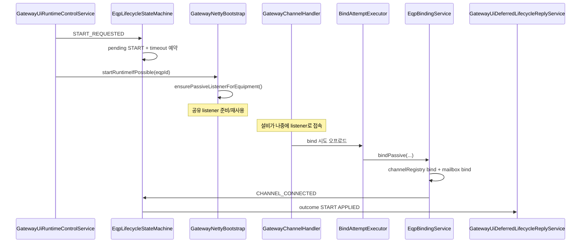
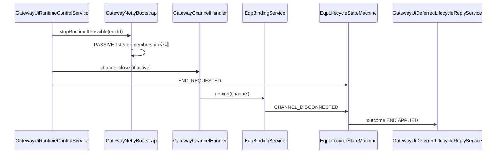

# 04. gateway 기준 PASSIVE 이벤트 생명주기 안내서

## 문서 목적

이 문서는 gateway 기준 `PASSIVE` 장비에서 이벤트가 발생했을 때, 요청 수신부터 실제 채널 bind/unbind, 상태머신 결과 확정까지의 생명주기를 상세히 설명합니다.

이 문서의 이벤트 범위(요청하신 추천 범위 적용):

1. `START_REQUESTED`
2. `END_REQUESTED`
3. `CHANNEL_CONNECTED`
4. `CHANNEL_DISCONNECTED`
5. `START_TIMEOUT`
6. `START_FAILED`
7. `END_TIMEOUT`

관련 문서:

1. 상태머신 공통 개념: [`03-lifecycle-state-machine-overview.md`](./03-lifecycle-state-machine-overview.md)
2. gateway 기준 ACTIVE: [`05-gateway-active-eqp-event-lifecycle.md`](./05-gateway-active-eqp-event-lifecycle.md)

## 1. 가장 중요한 전제: PASSIVE는 "gateway 기준"

gateway 기준 `PASSIVE`의 의미:

1. 설비가 게이트웨이로 먼저 연결을 시도합니다.
2. 게이트웨이는 listener(server)를 열어 연결을 받아야 합니다.
3. 따라서 START의 핵심은 "outbound connect"가 아니라 "listener 준비"입니다.

이 문서를 읽을 때 아래를 반드시 기억해 주세요.

1. gateway 기준 PASSIVE = 게이트웨이 입장 server(listener)
2. gateway 기준 ACTIVE = 게이트웨이 입장 client(outbound connect)

## 2. 관련 핵심 클래스 (먼저 보기)

1. `GatewayUiRuntimeControlService`
2. `EqpLifecycleStateMachine`
3. `GatewayNettyBootstrap`
4. `GatewayChannelHandlerFactory`
5. `GatewayChannelHandler`
6. `BindAttemptExecutor`
7. `EqpBindingService`
8. `GatewayProcessingService`
9. `EquipmentChannelRegistry`

대표 파일 경로:

1. `libs/comm/adapter/tc-comm-gateway-kafka-adapter/src/main/java/com/nori/tc/comm/adapters/kafka/ui/GatewayUiRuntimeControlService.java`
2. `libs/comm/tc-comm-gateway-core/src/main/java/com/nori/tc/comm/gateway/lifecycle/EqpLifecycleStateMachine.java`
3. `libs/comm/adapter/tc-comm-gateway-netty-adapter/src/main/java/com/nori/tc/comm/adapters/netty/GatewayNettyBootstrap.java`
4. `libs/comm/adapter/tc-comm-gateway-netty-adapter/src/main/java/com/nori/tc/comm/adapters/netty/GatewayChannelHandler.java`
5. `libs/comm/adapter/tc-comm-gateway-netty-adapter/src/main/java/com/nori/tc/comm/adapters/netty/BindAttemptExecutor.java`
6. `libs/comm/adapter/tc-comm-gateway-netty-adapter/src/main/java/com/nori/tc/comm/adapters/netty/EqpBindingService.java`

## 3. PASSIVE 장비 START의 핵심 개념 (한 줄 요약)

`START 요청 -> 상태머신 pending START -> Netty 공유 listener 준비 -> 설비 접속 수락 -> bind 성공 -> CHANNEL_CONNECTED -> START 성공 outcome`

중요한 점:

1. START 요청 직후 설비가 아직 접속하지 않았다면 `CONNECTING` 상태가 유지될 수 있습니다.
2. PASSIVE 장비의 START 성공은 listener 준비만으로 확정되지 않고, 실제 채널 bind까지 가야 `CHANNEL_CONNECTED` 기반으로 확정되는 경우가 일반적입니다.

## 4. PASSIVE 장비에서 사용하는 Netty 구조

## 4-1. 공유 listener (Shared Listener)

`GatewayNettyBootstrap`는 gateway 기준 PASSIVE 장비를 위해 공유 listener를 관리합니다.

핵심 특징:

1. 동일 `(interfaceType + port)` 조합은 listener를 공유할 수 있음
2. 내부적으로 `PassiveListenerKey`를 사용해 식별
3. listener 멤버십은 `eqpId` 단위로 관리

이 구조의 장점:

1. 같은 포트를 사용하는 여러 장비에 대해 listener 중복 생성 방지
2. 포트 충돌 감소
3. 리소스 효율 향상

## 4-2. SOCKET PASSIVE 공유 listener 제약 (매우 중요)

gateway 기준 PASSIVE이고 인터페이스가 SOCKET인 경우, 동일 포트에 대해 여러 장비가 listener를 공유할 수는 있지만 다음 제약이 있습니다.

1. 같은 포트에서는 하나의 `socketType`만 허용
2. 서로 다른 `socketType`가 섞이면 fail-fast
3. 실패 시 START 실패 신호(`PASSIVE_LISTENER_START_FAILED`)가 상태머신으로 전달될 수 있음

초급 개발자 포인트:

이 제약은 런타임 중 애매한 파싱 충돌을 막기 위한 보호장치입니다.

## 4-3. PASSIVE listener bind IP 정책

요약된 코드 확인 기준으로 PASSIVE 공유 listener의 bind IP는 정책상 고정값(`127.0.0.1`)을 사용합니다.

이 정책은 운영 환경 구성과 함께 확인해야 하며, 실제 접속 경로/프록시 구성과 연계해서 이해해야 합니다.

## 5. PASSIVE START 요청 생명주기 (상세)

이 섹션은 "gateway 기준 PASSIVE 장비 START 요청"의 표준 경로를 단계별로 설명합니다.

## 5-1. 단계 1: UI/운영 요청 수신

주요 경로:

1. `GatewayUiEventKafkaSubscriber`가 UI 이벤트 수신
2. `GatewayUiTaskDispatcher`가 `eqpId` 기준 mailbox로 enqueue
3. `KafkaTaskExecutionPipeline` 실행
4. `GatewayUiTaskProcessorRegistry`가 `EQP_START`를 deferred lifecycle task로 처리
5. `GatewayUiRuntimeControlService.startRuntime(...)` 호출

이 단계에서 중요한 점:

1. Kafka poll thread에서 바로 Netty 제어를 하지 않습니다.
2. 장비 단위 직렬 처리 구조를 통해 순서를 안정화합니다.

## 5-2. 단계 2: 상태머신에 START 요청 등록 (`START_REQUESTED`)

`GatewayUiRuntimeControlService`는 START 요청 시 상태머신과 Netty를 모두 호출합니다. 일반적인 흐름은 다음과 같습니다.

1. 장비/컨텍스트 검증
2. `lifecycleStateMachine.requestStart(...)`
3. `connectionControlPort.startRuntimeIfPossible(eqpId)` (`GatewayNettyBootstrap`)
4. 요청 접수 로그 (`LIFECYCLE_REQUEST_ACCEPTED` 성격)

상태머신 측 처리 (`handleStartRequested`):

1. stale request 검사
2. `desiredState = STARTED`
3. 채널이 아직 없으면 `runtimeState = CONNECTING`
4. pending START 등록
5. START timeout 예약

이 시점은 "최종 성공"이 아닙니다. 아직 설비가 접속하지 않았을 수 있습니다.

## 5-3. 단계 3: `GatewayNettyBootstrap.startRuntimeIfPossible(eqpId)` (PASSIVE 분기)

`GatewayNettyBootstrap`는 장비 정보를 조회하고 mode를 확인한 뒤 gateway 기준 PASSIVE 경로로 분기합니다.

PASSIVE 경로에서 핵심 동작:

1. 공유 listener 멤버십 준비/등록
2. 필요 시 `ensurePassiveListenerForEquipment(...)`로 listener 생성/재사용
3. 성공 시 "설비 접속 대기" 상태로 전환
4. 실패 시 cleanup 후 상태머신에 `onStartFailedIfPending(..., "PASSIVE_LISTENER_START_FAILED")`

초급 개발자 포인트:

PASSIVE START는 listener 준비가 핵심이며, 이 단계에서는 아직 `CHANNEL_CONNECTED`가 아닙니다.

## 5-4. 단계 4: 설비가 실제로 접속 (Netty inbound child channel 생성)

설비가 게이트웨이 listener로 접속하면 Netty가 child channel을 생성합니다.

`GatewayNettyBootstrap.startPassiveListenerServer(...)`에서 child pipeline은 일반적으로 다음 핸들러로 구성됩니다.

1. `GatewayChannelHandlerFactory.newPassiveHandler(...)`

여기서 `newPassiveHandler`라는 이름은 "게이트웨이가 수동으로 받는(inbound) 채널 처리" 관점의 naming이며, 현재 gateway 기준 `PASSIVE` 경로와 이름/의미가 일치합니다.

## 5-5. 단계 5: `GatewayChannelHandler.channelActive()`와 bind 준비

채널이 active되면 `GatewayChannelHandler.channelActive()`가 호출됩니다.

주요 동작(상황별):

1. bind 상태를 `UNBOUND`로 준비
2. metrics/카운터 증가
3. bind timeout 예약
4. 필요 시 SOCKET initialize 송신(구성/모드에 따라)

PASSIVE listener로 들어온 inbound 채널은 보통 아직 `eqpId`를 모를 수 있으므로, 즉시 bind 완료가 아니라 "bind 대기" 상태로 들어가는 경우가 많습니다.

## 5-6. 단계 6: `channelRead()`에서 bind 전 데이터 수집 + bind 시도

bind 전(`UNBOUND`) 상태에서 데이터가 들어오면:

1. 데이터를 `unboundInbox`에 임시 적재
2. `BindAttemptExecutor`를 통해 bind 시도 오프로드

왜 오프로드하나요?

1. HSMS/SOCKET 파싱/검증이 Netty I/O event loop를 오래 점유하지 않도록 하기 위해서입니다.
2. `BindAttemptExecutor`는 별도 executor에서 bind 관련 파싱/검증을 수행합니다.

추가 보호:

1. `unboundInbox` overflow 시 채널 close
2. bind timeout 만료 시 채널 close

## 5-7. 단계 7: `GatewayChannelHandler.attemptBind()` -> `EqpBindingService.bindPassive(...)`

gateway 기준 PASSIVE 장비는 게이트웨이 listener로 들어왔으므로, 바인딩은 보통 `EqpBindingService.bindPassive(...)` 경로를 탑니다.

중요: 메서드 이름 `bindPassive`는 "게이트웨이 측 채널 수용 방향(inbound/listener)" 관점의 naming이며, 현재 내부 검증 기대 모드도 gateway 기준 `ConnectionMode.PASSIVE`입니다.

`EqpBindingService` 주요 검증 순서:

1. `eqpId` 추출/유효성 확인
2. shard ownership 확인
3. 장비 정보 조회 (`GatewayProcessingService.resolveEquipment`)
4. `enabled` 여부 확인
5. interfaceType 일치 확인
6. connectionMode 일치 확인 (`PASSIVE`)
7. `EquipmentChannelRegistry.tryBind(...)`로 중복 연결 방지

성공 시 수행:

1. `GatewayProcessingService.bindMailbox(info, equipmentChannel)`
2. `EqpLifecycleStateMachine.onChannelConnected(eqpId, ..., "NETTY_BIND")`

이 시점에 상태머신은 `CHANNEL_CONNECTED` 이벤트를 받아 START 성공을 확정할 수 있습니다.

## 5-8. 단계 8: 상태머신 `CHANNEL_CONNECTED` 처리 -> START 성공 outcome

상태머신 처리 핵심:

1. `runtimeState = CONNECTED`
2. pending START가 있으면 START 적용 성공으로 확정
3. pending START 제거
4. outcome 발행 (`APPLIED`, reason 예: `NETTY_BIND` 계열/이미 연결 상태 등)

이 outcome은 `GatewayUiDeferredLifecycleReplyService`로 전달되어 UI 최종 응답(`EQP_START_REP`) publish에 사용됩니다.

## 6. PASSIVE START 실패/예외 경로 (상세)

## 6-1. listener 시작 실패 (`START_FAILED`)

발생 예시:

1. 공유 listener bind 실패
2. PASSIVE SOCKET 동일 포트 `socketType` 충돌
3. 기타 PASSIVE listener 초기화 실패

`GatewayNettyBootstrap` 동작:

1. 관련 상태 cleanup
2. `lifecycleStateMachine.onStartFailedIfPending(..., "PASSIVE_LISTENER_START_FAILED")`

상태머신 동작:

1. pending START 존재 시 `START_FAILED` 처리
2. 채널이 이미 활성인 예외적 상황이면 recovery
3. 아니면 `runtimeState = ERROR`
4. outcome `startFailed(PASSIVE_LISTENER_START_FAILED)`

## 6-2. 설비 접속 지연/미접속 (`START_TIMEOUT`)

listener는 정상적으로 열렸지만 설비가 접속하지 않으면 START timeout이 발생할 수 있습니다.

흐름:

1. START 요청으로 pending START 등록됨
2. listener 준비됨
3. timeout 내 `CHANNEL_CONNECTED`가 오지 않음
4. 상태머신 `START_TIMEOUT`
5. `runtimeState = ERROR` + outcome 실패

초급 개발자 주의:

listener가 열렸다는 사실과 START 성공은 다릅니다. 현재 상태머신 기준 START의 성공 확정은 채널 이벤트(`CHANNEL_CONNECTED`)에 더 가깝습니다.

## 6-3. bind 실패/중복 채널/샤드 불일치

설비는 접속했지만 bind 단계에서 실패할 수 있습니다.

예시:

1. `eqpId` 파싱 실패
2. shard ownership 불일치
3. 장비 disabled
4. interfaceType 불일치
5. connectionMode 불일치
6. 이미 다른 활성 채널이 있어 `tryBind` 실패

결과:

1. 채널 close 또는 bind 거부
2. `CHANNEL_CONNECTED`가 상태머신으로 가지 않음
3. START pending이 남아 timeout으로 실패할 가능성 있음

## 6-4. bind timeout (`GatewayChannelHandler` 레벨)

채널은 열렸지만 지정 시간 내 bind가 끝나지 않으면:

1. `BIND_TIMEOUT` 로그
2. 채널 close
3. `EqpBindingService.unbind(...)` 경로가 불리면 `CHANNEL_DISCONNECTED` 반영 가능

이 경로는 보통 START 성공으로 이어지지 않고 timeout/실패 쪽으로 가기 쉽습니다.

## 7. PASSIVE END 요청 생명주기 (상세)

END는 START보다 헷갈리는 경우가 많습니다. 이유는 "listener 멤버십 정리", "채널 close", "상태머신 END 요청"의 순서가 비동기 타이밍에 따라 엇갈릴 수 있기 때문입니다.

## 7-1. 단계 1: END 요청 수신 (`GatewayUiRuntimeControlService.endRuntime(...)`)

`GatewayUiRuntimeControlService.endRuntime(...)`는 대략 다음 동작을 수행합니다.

1. 장비/컨텍스트/상태 검증
2. `connectionControlPort.stopRuntimeIfPossible(eqpId)`
3. 활성 채널이 있으면 close 시도
4. `lifecycleStateMachine.requestEnd(...)`

중요:

2~4번은 실제로는 비동기 영향으로 순서 효과가 달라질 수 있습니다. 예를 들어 channel close callback이 매우 빨리 실행되면 `CHANNEL_DISCONNECTED`가 `END_REQUESTED`보다 먼저 상태머신에 도착할 수 있습니다.

## 7-2. 단계 2: `GatewayNettyBootstrap.stopRuntimeIfPossible(eqpId)` (PASSIVE 분기)

gateway 기준 PASSIVE 경로에서의 핵심 동작:

1. shared listener 멤버십 해제
2. 이 장비와 연관된 listener key 정리
3. 해당 listener의 마지막 멤버라면 listener 서버 종료

즉, PASSIVE 장비 종료는 "채널 종료"뿐 아니라 "공유 listener 자원 관리"가 핵심입니다.

## 7-3. 단계 3: 채널 종료와 unbind (`CHANNEL_DISCONNECTED`)

채널이 닫히면 `GatewayChannelHandler.channelInactive()`가 호출되고, 내부적으로 `EqpBindingService.unbind(channel)` 경로가 실행됩니다.

`EqpBindingService.unbind(...)` 주요 동작:

1. `EquipmentChannelRegistry`에서 채널 제거
2. `GatewayProcessingService.removeMailbox(eqpId)`
3. `EqpLifecycleStateMachine.onChannelDisconnected(eqpId, "SYSTEM", "NETTY_UNBIND")`

상태머신은 `CHANNEL_DISCONNECTED`를 받아 `runtimeState = DISCONNECTED`로 반영합니다.

## 7-4. 단계 4: 상태머신 `END_REQUESTED` 처리와 최종 END 성공 확정

타이밍에 따라 두 가지 대표 경로가 있습니다.

### 경로 A: `END_REQUESTED`가 먼저 처리된 경우

1. 상태머신 `desiredState = ENDED`
2. 채널이 아직 살아 있으면 `runtimeState = STOPPING`
3. pending END 등록 + timeout 예약
4. 이후 `CHANNEL_DISCONNECTED` 도착
5. END 성공 확정 + mailbox 정리 + outcome 발행

### 경로 B: `CHANNEL_DISCONNECTED`가 먼저 처리된 경우

1. 상태머신이 먼저 `runtimeState = DISCONNECTED` 반영
2. 나중에 `END_REQUESTED` 처리 시 "이미 끊김"으로 판단
3. 즉시 END 적용 성공 (`ALREADY_DISCONNECTED`)
4. outcome 발행

초급 개발자 포인트:

두 경로 모두 정상일 수 있습니다. 비동기 시스템에서는 이벤트 순서가 약간 달라져도 결과가 일관되게 나오는 설계가 중요합니다.

## 8. PASSIVE END 실패/예외 경로

## 8-1. `END_TIMEOUT`

조건:

1. `END_REQUESTED`가 pending END로 등록됨
2. timeout 내 `CHANNEL_DISCONNECTED`가 오지 않음

상태머신 처리:

1. 채널이 이미 비활성이면 recovery (`TIMEOUT_RECOVERED`) 가능
2. 아니면 `runtimeState = ERROR`
3. outcome `endFailed(END_TIMEOUT)`

## 8-2. listener 멤버십은 해제됐지만 채널이 남아 있는 경우

가능한 문제 상황:

1. shared listener는 정리됐지만 기존 채널 close가 지연됨
2. 상태머신 END timeout 발생 가능

이때 확인할 포인트:

1. `GatewayUiRuntimeControlService`에서 채널 close 호출 여부
2. `GatewayChannelHandler.channelInactive()` 로그 여부
3. `EqpBindingService.unbind(...)` 실행 여부

## 9. 이벤트별 정리표 (PASSIVE)

| 이벤트 | 발생 주체 | PASSIVE 경로에서의 의미 | 상태머신 주요 반응 |
|---|---|---|---|
| `START_REQUESTED` | `GatewayUiRuntimeControlService` | PASSIVE 장비 시작 요청 수락 | `desired=STARTED`, `runtime=CONNECTING`, pending START |
| `START_FAILED` | `GatewayNettyBootstrap` | 공유 listener 시작 실패/제약 위반 등 | pending START 실패 확정 또는 recovery |
| `CHANNEL_CONNECTED` | `EqpBindingService` | 설비가 listener에 접속 후 bind 성공 | `runtime=CONNECTED`, START 성공 확정 |
| `START_TIMEOUT` | 상태머신 내부 scheduler | timeout 내 bind 성공 이벤트 미수신 | `runtime=ERROR`, START 실패 확정(조건부 recovery 가능) |
| `END_REQUESTED` | `GatewayUiRuntimeControlService` | PASSIVE 장비 종료 요청 | `desired=ENDED`, `runtime=STOPPING` 또는 즉시 성공 |
| `CHANNEL_DISCONNECTED` | `EqpBindingService.unbind` | 채널 종료/unbind 완료 | `runtime=DISCONNECTED`, END 성공 확정 가능 |
| `END_TIMEOUT` | 상태머신 내부 scheduler | timeout 내 채널 종료 이벤트 미수신 | `runtime=ERROR`, END 실패 확정(조건부 recovery 가능) |

## 10. PASSIVE START/END 시퀀스 다이어그램

## 10-1. START 성공 시나리오 (대표)

## 10-2. END 성공 시나리오 (비동기 순서 허용)

참고:

실제 실행에서는 `CHANNEL_DISCONNECTED`가 `END_REQUESTED`보다 먼저 도착할 수도 있습니다. 상태머신은 이를 허용하도록 설계되어 있습니다.

## 11. 로그/메트릭 관점에서 어디를 보면 좋은가

초급 개발자 기준으로 PASSIVE(listener) 경로 문제를 볼 때 확인 순서를 추천합니다.

1. `GatewayUiRuntimeControlService`
   - START/END 요청 접수 로그 (`LIFECYCLE_REQUEST_ACCEPTED` 계열)
2. `GatewayNettyBootstrap`
   - shared listener 시작/재사용/멤버십 해제 로그
   - PASSIVE listener 실패 로그
3. `GatewayChannelHandler`
   - `channelActive`, bind timeout, bind 성공/실패, `channelInactive`
4. `EqpBindingService`
   - bind 검증 실패 이유, `CHANNEL_CONNECTED/DISCONNECTED` 발생 지점
5. `EqpLifecycleStateMachine`
   - pending, timeout, outcome 성공/실패
6. `GatewayUiDeferredLifecycleReplyService`
   - START/END 최종 응답 publish 여부

## 12. PASSIVE 경로에서 초급 개발자가 자주 헷갈리는 포인트

1. "listener가 열렸으면 START 성공 아닌가요?"
   - 아닙니다. 보통 `CHANNEL_CONNECTED` (bind 성공)까지 가야 START 성공 확정입니다.
2. "`bindPassive`라는 메서드 이름이면 gateway 기준 PASSIVE 경로가 맞나요?"
   - 맞습니다. 현재 기준에서는 gateway PASSIVE(listener/inbound) 경로에서 `bindPassive(...)`가 사용됩니다.
3. "END 요청 후 `CHANNEL_DISCONNECTED`가 먼저 와도 이상한가요?"
   - 비동기 시스템에서는 정상일 수 있습니다. 상태머신이 이를 흡수하도록 설계되어 있습니다.

## 13. PASSIVE 경로 디버깅 체크리스트 (실전용)

### START 실패 시

1. 상태머신에 `START_REQUESTED`가 들어왔는가?
2. `GatewayNettyBootstrap`가 PASSIVE listener를 만들었는가/재사용했는가?
3. SOCKET PASSIVE 포트/`socketType` 충돌은 없는가?
4. 설비가 실제로 listener에 접속했는가? (`channelActive`)
5. bind가 성공했는가? (`EqpBindingService.bindPassive`)
6. `CHANNEL_CONNECTED`가 상태머신에 들어왔는가?
7. `START_TIMEOUT` 또는 `START_FAILED`가 먼저 발생했는가?

### END 실패 시

1. `stopRuntimeIfPossible`에서 listener 멤버십이 해제되었는가?
2. 활성 채널 close가 호출되었는가?
3. `channelInactive`가 발생했는가?
4. `EqpBindingService.unbind`가 실행되었는가?
5. `CHANNEL_DISCONNECTED`가 상태머신에 들어왔는가?
6. `END_TIMEOUT`이 발생했는가?

## 14. 다음 문서 안내

다음 문서 [`05-gateway-active-eqp-event-lifecycle.md`](./05-gateway-active-eqp-event-lifecycle.md)에서는 gateway 기준 ACTIVE 장비의 outbound connect/reconnect 중심 생명주기를 설명합니다.
