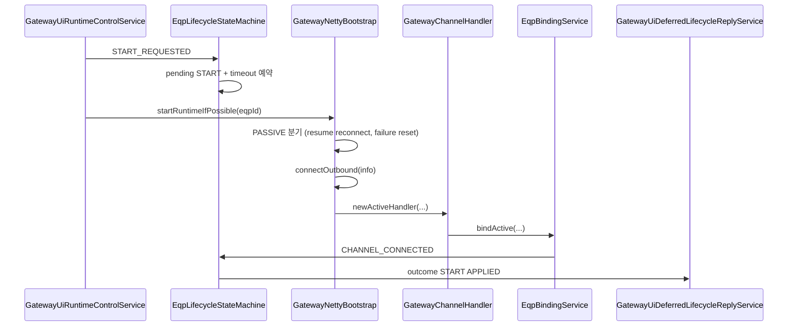
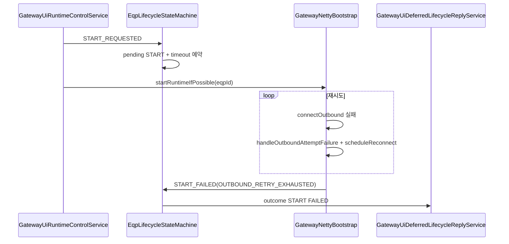
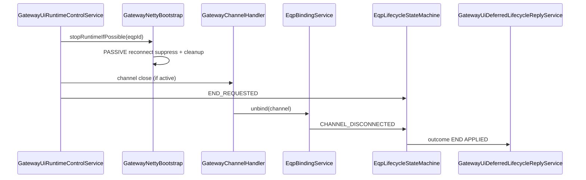

# 05. 설비 기준 PASSIVE 이벤트 생명주기 안내서

## 문서 목적

이 문서는 설비 기준 `PASSIVE` 장비에서 이벤트가 발생했을 때, START/END 요청부터 outbound connect/reconnect, bind/unbind, 상태머신 결과 확정까지의 생명주기를 상세히 설명합니다.

이 문서의 이벤트 범위(추천 범위 적용):

1. `START_REQUESTED`
2. `END_REQUESTED`
3. `CHANNEL_CONNECTED`
4. `CHANNEL_DISCONNECTED`
5. `START_TIMEOUT`
6. `START_FAILED`
7. `END_TIMEOUT`

관련 문서:

1. 상태머신 공통 개념: [`03-lifecycle-state-machine-overview.md`](./03-lifecycle-state-machine-overview.md)
2. 설비 기준 ACTIVE: [`04-active-eqp-event-lifecycle.md`](./04-active-eqp-event-lifecycle.md)

## 1. 가장 중요한 전제: PASSIVE는 "설비 기준"

설비 기준 `PASSIVE`의 의미:

1. 설비는 연결을 기다리는 쪽입니다.
2. 게이트웨이가 설비로 outbound connect를 시도해야 합니다.
3. 따라서 START의 핵심은 "listener 준비"가 아니라 "outbound connect + reconnect 관리"입니다.

초급 개발자가 가장 많이 헷갈리는 부분:

`GatewayConnectionControlPort` / `GatewayNettyBootstrap`에 `connectActiveIfPossible`, `suppressActiveReconnect` 같은 메서드 이름이 보이는데, 이것은 역사적인 naming이 섞여 있습니다. 실제 의미 해석은 반드시 `ConnectionMode`(설비 기준)로 해야 합니다.

## 2. 관련 핵심 클래스 (먼저 보기)

1. `GatewayUiRuntimeControlService`
2. `EqpLifecycleStateMachine`
3. `GatewayNettyBootstrap`
4. `GatewayChannelHandlerFactory`
5. `GatewayChannelHandler`
6. `EqpBindingService`
7. `GatewayProcessingService`
8. `EquipmentChannelRegistry`

대표 파일 경로:

1. `libs/comm/adapter/tc-comm-gateway-kafka-adapter/src/main/java/com/nori/tc/comm/adapters/kafka/ui/GatewayUiRuntimeControlService.java`
2. `libs/comm/tc-comm-gateway-core/src/main/java/com/nori/tc/comm/gateway/lifecycle/EqpLifecycleStateMachine.java`
3. `libs/comm/adapter/tc-comm-gateway-netty-adapter/src/main/java/com/nori/tc/comm/adapters/netty/GatewayNettyBootstrap.java`
4. `libs/comm/adapter/tc-comm-gateway-netty-adapter/src/main/java/com/nori/tc/comm/adapters/netty/GatewayChannelHandler.java`
5. `libs/comm/adapter/tc-comm-gateway-netty-adapter/src/main/java/com/nori/tc/comm/adapters/netty/EqpBindingService.java`

## 3. PASSIVE 장비 START의 핵심 개념 (한 줄 요약)

`START 요청 -> 상태머신 pending START -> Netty outbound connect 시도 -> bind 성공 -> CHANNEL_CONNECTED -> START 성공`

실패/지연 경로에서는 다음이 중요합니다.

1. reconnect 스케줄링
2. suppress/resume 제어
3. 재시도 한도 초과 시 `START_FAILED(OUTBOUND_RETRY_EXHAUSTED)`

## 4. PASSIVE 장비에서 사용하는 Netty 구조

## 4-1. outbound connect 중심 구조

설비 기준 PASSIVE 장비의 START에서는 `GatewayNettyBootstrap`가 설비 IP/Port로 outbound connect를 시도합니다.

핵심 메서드 흐름(요약):

1. `startRuntimeIfPossible(eqpId)`
2. PASSIVE 분기 진입
3. reconnect suppress 해제 (`resumeActiveReconnect`)
4. outbound connect 시도 (`connectActiveIfPossible`)  ※ 이름은 legacy
5. 내부적으로 `connectOutbound(info)`

초급 개발자 포인트:

메서드 이름만 보고 "ACTIVE 장비용 메서드"라고 해석하면 잘못입니다. 실제 PASSIVE 장비 outbound connect 경로에서 사용됩니다.

## 4-2. reconnect / suppress / failure counter

`GatewayNettyBootstrap`는 PASSIVE 장비 outbound connect를 위해 다음 상태를 관리합니다.

1. reconnect suppress 상태
   - END 요청 등으로 자동 재연결을 멈추고 싶을 때 사용
2. 연속 실패 카운터
   - connect 실패 횟수 누적
3. reconnect scheduler
   - 지연 후 재시도 예약

핵심 정책:

1. 실패 횟수가 임계값 이하면 재시도
2. 임계값 초과 시 suppress + `START_FAILED(OUTBOUND_RETRY_EXHAUSTED)` 신호 가능

## 5. PASSIVE START 요청 생명주기 (상세)

## 5-1. 단계 1: UI/운영 요청 수신

UI 이벤트 처리 경로는 ACTIVE와 동일한 상위 구조를 탑니다.

1. `GatewayUiEventKafkaSubscriber`
2. `GatewayUiTaskDispatcher`
3. `KafkaTaskExecutionPipeline`
4. `GatewayUiTaskProcessorRegistry`
5. `GatewayUiRuntimeControlService.startRuntime(...)`

차이는 `GatewayNettyBootstrap.startRuntimeIfPossible(...)` 내부의 mode 분기에서 발생합니다.

## 5-2. 단계 2: 상태머신 `START_REQUESTED` 처리

`GatewayUiRuntimeControlService.startRuntime(...)`는 START 요청 시 상태머신과 Netty 제어를 연결합니다.

일반 흐름:

1. 장비/컨텍스트 검증
2. `lifecycleStateMachine.requestStart(...)`
3. `connectionControlPort.startRuntimeIfPossible(eqpId)`
4. 요청 접수 로그

상태머신 처리 요약:

1. `desiredState = STARTED`
2. 현재 채널 없으면 `runtimeState = CONNECTING`
3. pending START 등록
4. START timeout 예약

이 시점은 아직 설비 연결 성공이 아닙니다.

## 5-3. 단계 3: `GatewayNettyBootstrap.startRuntimeIfPossible(eqpId)` (PASSIVE 분기)

PASSIVE 분기에서 핵심 동작:

1. ACTIVE listener 멤버십 관련 상태 정리 (필요 시)
2. reconnect suppress 해제 (`resumeActiveReconnect`)
3. 연속 실패 카운터 reset
4. outbound connect 시도 (`connectActiveIfPossible` -> `connectOutbound`)

이 단계에서 중요한 검증:

1. 게이트웨이 런타임이 실행 중인지
2. shard ownership가 맞는지
3. 장비가 enabled인지
4. mode가 PASSIVE인지
5. IP/port가 유효한지

## 5-4. 단계 4: `connectOutbound(info)`에서 실제 connect 시도

`connectOutbound(info)`의 핵심 역할:

1. worker event loop 사용
2. suppress 여부 검사
3. `Bootstrap.connect(ip, port)` 호출
4. channel pipeline에 `GatewayChannelHandlerFactory.newActiveHandler(...)` 등록

여기서 `newActiveHandler(...)`는 "게이트웨이가 먼저 outbound로 연결한 채널"에 대한 핸들러입니다. 설비 기준으로는 PASSIVE 장비 경로입니다.

## 5-5. 단계 5: outbound channel `channelActive()`와 bind 시작

outbound connect가 성공하면 `GatewayChannelHandler.channelActive()`가 호출됩니다.

PASSIVE 장비 경로의 특징:

1. handler가 `presetEqpId`를 가지고 시작할 수 있음 (`newActiveHandler(...)` 경로)
2. HSMS outbound(비-SOCKET)인 경우 `channelActive()` 시점에 즉시 bind 시도 가능
3. SOCKET인 경우 initialize/초기 handshake 후 bind가 완료될 수 있음

즉, PASSIVE START에서 `CHANNEL_CONNECTED`까지 걸리는 시간은 인터페이스 타입(HSMS/SOCKET) 및 handshake 진행에 따라 달라질 수 있습니다.

## 5-6. 단계 6: bind 시도 (`EqpBindingService.bindActive(...)`)

설비 기준 PASSIVE 장비의 outbound 채널 bind는 보통 `EqpBindingService.bindActive(...)` 경로를 탑니다.

중요: `bindActive`라는 메서드 이름은 게이트웨이의 채널 시작 방식(outbound) 관점이며, 내부적으로 기대 connection mode는 설비 기준 `PASSIVE`입니다.

`EqpBindingService` 주요 검증:

1. `eqpId` 유효성
2. shard ownership
3. 장비 정보 조회
4. enabled 여부
5. interfaceType 일치
6. connectionMode 일치 (`PASSIVE`)
7. `EquipmentChannelRegistry.tryBind(...)` (중복 연결 방지)

성공 시:

1. `GatewayProcessingService.bindMailbox(...)`
2. `EqpLifecycleStateMachine.onChannelConnected(eqpId, expectedMode.name(), "NETTY_BIND")`

## 5-7. 단계 7: 상태머신 `CHANNEL_CONNECTED` 처리 -> START 성공 outcome

상태머신 처리:

1. `runtimeState = CONNECTED`
2. pending START가 있으면 START 성공 확정
3. pending START 제거
4. outcome 발행 (`APPLIED`)

이 outcome은 `GatewayUiDeferredLifecycleReplyService`에서 받아 UI 최종 응답(`EQP_START_REP`)으로 변환됩니다.

## 6. PASSIVE START 실패/예외 경로 (핵심)

PASSIVE 경로는 ACTIVE보다 "재시도/자동복구" 요소가 많아서 실패 경로 이해가 매우 중요합니다.

## 6-1. connect 시도 실패 -> 재시도 스케줄링

`Bootstrap.connect(...)`가 실패하면 `GatewayNettyBootstrap.handleOutboundAttemptFailure(...)` 경로로 들어갑니다.

주요 동작:

1. 연속 실패 카운터 증가
2. 임계값 미만이면 `scheduleReconnect(...)`
3. 지연 후 다시 `connectOutbound(...)` 시도

초급 개발자 포인트:

첫 실패가 곧바로 START 실패를 의미하지는 않습니다. 재시도 정책이 먼저 적용될 수 있습니다.

## 6-2. 재시도 한도 초과 -> `START_FAILED(OUTBOUND_RETRY_EXHAUSTED)`

연속 실패 카운터가 최대 허용 횟수를 넘으면:

1. reconnect suppress 상태로 전환
2. 상태머신에 `onStartFailedIfPending(..., "OUTBOUND_RETRY_EXHAUSTED")`

상태머신 처리:

1. pending START가 있으면 `START_FAILED` 이벤트 처리
2. 이미 채널이 활성인 경우 recovery 가능
3. 아니면 `runtimeState = ERROR`
4. outcome `startFailed(OUTBOUND_RETRY_EXHAUSTED)`

UI 응답 관점:

`GatewayUiDeferredLifecycleReplyService`는 이 reason을 UI 에러 코드(예: `EQP_START_RETRY_EXHAUSTED`)로 매핑할 수 있습니다.

## 6-3. START timeout (`START_TIMEOUT`)

connect/reconnect 시도가 진행 중이지만 timeout 내 `CHANNEL_CONNECTED`가 오지 않으면 상태머신 START timeout이 발생할 수 있습니다.

가능한 상황:

1. connect 반복 중인데 timeout 먼저 만료
2. handshake/bind가 늦어짐
3. bind 검증 실패로 `CHANNEL_CONNECTED`가 오지 않음

상태머신 처리:

1. timeout 시점 채널 활성 여부 재확인
2. 활성 아니면 `runtimeState = ERROR`
3. outcome `startFailed(START_TIMEOUT)`

주의:

Netty 쪽 reconnect 로직과 상태머신 timeout은 별개 축입니다. 둘의 타이밍이 엇갈릴 수 있습니다.

## 6-4. outbound connect 성공 후 bind 실패

connect는 됐지만 bind 단계에서 실패하는 케이스:

1. interfaceType mismatch
2. connectionMode mismatch
3. shard ownership mismatch
4. 중복 채널 존재
5. SOCKET initialize 응답의 eqpId가 presetEqpId와 불일치

`GatewayChannelHandler`는 상황에 따라 채널을 close할 수 있고, 결과적으로 `CHANNEL_CONNECTED` 없이 `CHANNEL_DISCONNECTED` 또는 timeout/재시도로 이어질 수 있습니다.

## 7. PASSIVE 경로의 "예상치 못한 끊김" (운영 중 reconnect)

이 시나리오는 UI START/END 요청과 별개로 운영 중 자주 발생합니다.

## 7-1. 이미 CONNECTED 상태에서 채널이 끊긴 경우

흐름:

1. `GatewayChannelHandler.channelInactive()`
2. `EqpBindingService.unbind(channel)`
3. `EquipmentChannelRegistry` 제거
4. `GatewayProcessingService.removeMailbox(eqpId)`
5. 상태머신 `CHANNEL_DISCONNECTED`

상태머신 관점:

1. pending END가 없으면 단순 `runtimeState = DISCONNECTED` 반영
2. "실패 확정"이 자동으로 되지는 않음 (현재 pending START가 없다면 `START_FAILED`와 직접 연결되지 않을 수 있음)

## 7-2. Netty 자동 reconnect

PASSIVE 장비이고 suppress 상태가 아니라면, `GatewayNettyBootstrap`는 채널 종료 후 reconnect를 스케줄링할 수 있습니다.

결과:

1. reconnect 성공 -> 다시 bind -> `CHANNEL_CONNECTED`
2. 반복 실패 누적 -> 임계값 초과 시 suppress

초급 개발자 포인트:

운영 중 reconnect는 "새 START 요청" 없이도 발생할 수 있습니다. 따라서 로그를 볼 때 UI 요청 로그가 없다고 해서 이상한 것이 아닐 수 있습니다.

## 8. PASSIVE END 요청 생명주기 (상세)

## 8-1. 단계 1: `GatewayUiRuntimeControlService.endRuntime(...)` 호출

PASSIVE 경로에서 중요한 특이점:

1. PASSIVE + 활성 채널 없음인 경우 "이미 종료"로 간주하여 예외 (`EQP_ALREADY_DISCONNECTED`) 처리할 수 있음

즉, ACTIVE와 비교해 PASSIVE END는 "현재 outbound 연결이 실제로 존재하는지"를 더 엄격하게 확인할 수 있습니다.

## 8-2. 단계 2: `stopRuntimeIfPossible(eqpId)` (PASSIVE 분기)

PASSIVE 분기 핵심 동작:

1. 자동 reconnect 억제(suppress) 설정
2. 관련 reconnect 상태/예약 정리(cleanup)

이 동작의 목적:

END 요청 후 채널이 끊겼을 때 자동 reconnect가 다시 발생하지 않도록 하기 위함입니다.

## 8-3. 단계 3: 채널 close + `CHANNEL_DISCONNECTED`

활성 채널이 있으면 close가 시도되고, 이후 `EqpBindingService.unbind(...)` 경로에서 상태머신으로 `CHANNEL_DISCONNECTED`가 전달됩니다.

이 과정에서 수행되는 대표 동작:

1. `EquipmentChannelRegistry` 제거
2. `GatewayProcessingService.removeMailbox(eqpId)`
3. 상태머신 `runtimeState = DISCONNECTED`

## 8-4. 단계 4: 상태머신 `END_REQUESTED`와 최종 결과 확정

ACTIVE와 동일하게 비동기 타이밍에 따라 두 패턴이 모두 가능할 수 있습니다.

1. `END_REQUESTED` 먼저 -> pending END -> `CHANNEL_DISCONNECTED` 도착 -> END 성공
2. `CHANNEL_DISCONNECTED` 먼저 -> 나중 `END_REQUESTED`가 `ALREADY_DISCONNECTED`로 즉시 성공

핵심은 결과 일관성입니다. 상태머신은 이벤트 순서 차이를 흡수하도록 설계되어 있습니다.

## 9. PASSIVE END 실패/예외 경로

## 9-1. `END_TIMEOUT`

조건:

1. pending END가 등록됨
2. timeout 내 `CHANNEL_DISCONNECTED`가 오지 않음

상태머신 처리:

1. timeout 시점 채널이 이미 비활성이면 recovery (`TIMEOUT_RECOVERED`)
2. 아니면 `runtimeState = ERROR`
3. outcome `endFailed(END_TIMEOUT)`

## 9-2. suppress 누락으로 재연결이 다시 발생하는 경우 (운영 확인 포인트)

설계상 END 시 PASSIVE 재연결은 suppress되어야 합니다. 만약 종료 직후 reconnect가 반복된다면 아래를 확인합니다.

1. `stopRuntimeIfPossible` PASSIVE 분기가 실제 호출되었는가?
2. suppress 상태가 설정되었는가?
3. 기존 reconnect 예약이 정리되었는가?

## 10. 이벤트별 정리표 (PASSIVE)

| 이벤트 | 발생 주체 | PASSIVE 경로에서의 의미 | 상태머신 주요 반응 |
|---|---|---|---|
| `START_REQUESTED` | `GatewayUiRuntimeControlService` | PASSIVE 장비 outbound connect 시작 요청 | `desired=STARTED`, `runtime=CONNECTING`, pending START |
| `CHANNEL_CONNECTED` | `EqpBindingService` | outbound connect + bind 성공 | `runtime=CONNECTED`, START 성공 확정 |
| `START_FAILED` | `GatewayNettyBootstrap` | 재시도 한도 초과 등으로 start 실패 확정 신호 | pending START 실패 확정 또는 recovery |
| `START_TIMEOUT` | 상태머신 내부 scheduler | timeout 내 bind 성공 없음 | `runtime=ERROR`, START 실패 확정(조건부 recovery 가능) |
| `CHANNEL_DISCONNECTED` | `EqpBindingService.unbind` | 채널 종료/unbind 완료 | `runtime=DISCONNECTED`, END 성공 확정 가능 또는 운영 중 재연결 트리거 상황 |
| `END_REQUESTED` | `GatewayUiRuntimeControlService` | PASSIVE 장비 종료 요청 | `desired=ENDED`, `runtime=STOPPING` 또는 즉시 성공 |
| `END_TIMEOUT` | 상태머신 내부 scheduler | timeout 내 종료 이벤트 미수신 | `runtime=ERROR`, END 실패 확정(조건부 recovery 가능) |

## 11. PASSIVE START/END 시퀀스 다이어그램

## 11-1. START 성공 시나리오 (대표)

## 11-2. START 실패 시나리오 (재시도 한도 초과)

## 11-3. END 성공 시나리오 (대표)

## 12. 로그/메트릭 관점에서 어디를 보면 좋은가

PASSIVE 경로는 재시도 로그가 많아질 수 있으므로 순서 있게 보는 것이 중요합니다.

1. `GatewayUiRuntimeControlService`
   - START/END 요청 접수 로그
2. `GatewayNettyBootstrap`
   - `startRuntimeIfPossible` mode 분기
   - `connectOutbound` 시도/실패
   - `handleOutboundAttemptFailure`, `scheduleReconnect`
   - suppress/resume 로그
3. `GatewayChannelHandler`
   - `channelActive`, bind 시도, bind timeout, `channelInactive`
4. `EqpBindingService`
   - `bindActive` 검증 실패 이유
   - `CHANNEL_CONNECTED`, `CHANNEL_DISCONNECTED` 전달 여부
5. `EqpLifecycleStateMachine`
   - pending / timeout / `START_FAILED` / outcome
6. `GatewayUiDeferredLifecycleReplyService`
   - 최종 START/END 응답 publish 여부

## 13. PASSIVE 경로에서 초급 개발자가 자주 헷갈리는 포인트

1. "`connectActiveIfPossible`는 ACTIVE 장비 전용 메서드 아닌가요?"
   - 아닙니다. 메서드 이름은 legacy이며, 설비 기준 PASSIVE outbound connect 경로에서 사용될 수 있습니다.
2. "connect 실패 한 번이면 START 실패인가요?"
   - 아닙니다. 재시도 정책이 먼저 적용됩니다.
3. "운영 중 채널이 끊겼는데 UI START 요청이 없었습니다. 이상한가요?"
   - 아닙니다. PASSIVE 경로는 자동 reconnect가 동작할 수 있습니다.
4. "END 했는데 왜 다시 연결하려고 하나요?"
   - 정상이라면 suppress가 걸려야 합니다. suppress 설정/cleanup 여부를 확인해야 합니다.

## 14. PASSIVE 경로 디버깅 체크리스트 (실전용)

### START 실패 시

1. 상태머신 `START_REQUESTED`가 들어왔는가?
2. `startRuntimeIfPossible`가 PASSIVE 분기로 들어갔는가?
3. suppress가 해제되었는가?
4. `connectOutbound`가 실제로 호출되었는가?
5. connect 실패가 재시도되고 있는가?
6. bind(`bindActive`)가 성공했는가?
7. `CHANNEL_CONNECTED`가 상태머신에 들어왔는가?
8. `START_TIMEOUT` 또는 `OUTBOUND_RETRY_EXHAUSTED`가 발생했는가?

### END 실패 시

1. PASSIVE + no channel 예외(`EQP_ALREADY_DISCONNECTED`)로 끝난 것은 아닌가?
2. `stopRuntimeIfPossible`에서 suppress가 설정되었는가?
3. 채널 close가 수행되었는가?
4. `channelInactive` / `unbind`가 실행되었는가?
5. `CHANNEL_DISCONNECTED`가 상태머신에 들어왔는가?
6. `END_TIMEOUT`이 발생했는가?

## 15. 다음 문서 안내

다음 문서 [`06-kafka-tc-eqp-commands-to-equipment-lifecycle.md`](./06-kafka-tc-eqp-commands-to-equipment-lifecycle.md)에서는 `tc.eqp.commands` 메시지가 Kafka에서 들어와 설비로 송신되기까지의 전체 경로를 설명합니다.
