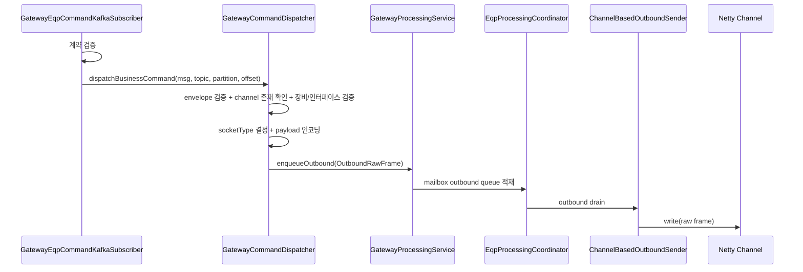
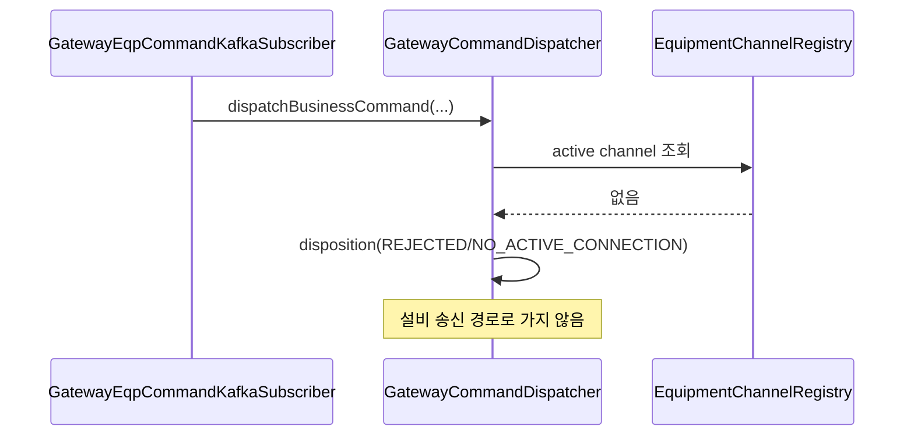
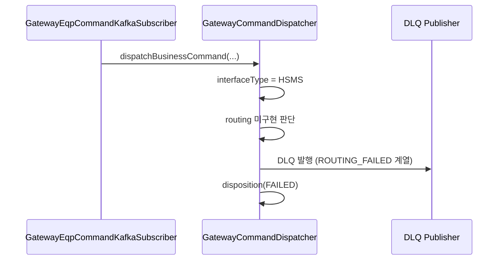

# 06. Kafka `tc.eqp.commands` -> 설비 송신 생명주기 안내서

## 문서 목적

이 문서는 Kafka 토픽 `tc.eqp.commands`를 구독한 메시지가 게이트웨이 내부를 통과하여 실제 설비 채널로 나가기까지의 전체 생명주기를 설명합니다.

초급 개발자가 이 문서를 읽고 이해해야 하는 핵심은 다음입니다.

1. Kafka에서 메시지를 읽었다고 해서 항상 설비로 전송되는 것은 아닙니다.
2. 계약 검증, 장비 채널 상태, 인터페이스 타입, 인코딩, 큐 적재 단계에서 여러 실패 분기가 있습니다.
3. 실패는 상황에 따라 drop, DLQ, quarantine로 나뉩니다.

관련 문서:

1. Bean 구조: [`02-context-bean-map.md`](./02-context-bean-map.md)
2. gateway 기준 PASSIVE/ACTIVE 채널 생명주기: [`04-gateway-passive-eqp-event-lifecycle.md`](./04-gateway-passive-eqp-event-lifecycle.md), [`05-gateway-active-eqp-event-lifecycle.md`](./05-gateway-active-eqp-event-lifecycle.md)
3. 운영 설정 체크리스트: [`07-config-runtime-topics-checklist.md`](./07-config-runtime-topics-checklist.md)

## 1. 먼저 알아야 할 사실 (매우 중요)

현재 코드 기준으로 `GatewayCommandDispatcher`에서 **HSMS business command 라우팅은 미구현 경로**입니다.

의미:

1. `tc.eqp.commands` 메시지가 들어와도 인터페이스 타입이 HSMS이면 일반적으로 실제 송신까지 가지 못할 수 있습니다.
2. 해당 케이스는 DLQ로 처리될 수 있습니다.
3. 따라서 운영/테스트 시 "왜 Kafka는 읽는데 설비로 안 나가지?"를 볼 때 인터페이스 타입을 먼저 확인해야 합니다.

## 2. 관련 핵심 클래스 (먼저 보기)

1. `GatewayEqpCommandKafkaSubscriber`
2. `AbstractGatewayKafkaSubscriber`
3. `GatewayKafkaContractSupport` (계약 검증 보조)
4. `GatewayCommandDispatcher`
5. `GatewayProcessingService`
6. `EqpProcessingCoordinator`
7. `ChannelBasedOutboundSender`
8. `EquipmentChannelRegistry`

대표 파일 경로:

1. `libs/comm/adapter/tc-comm-gateway-kafka-adapter/src/main/java/com/nori/tc/comm/adapters/kafka/subscribe/GatewayEqpCommandKafkaSubscriber.java`
2. `libs/comm/adapter/tc-comm-gateway-kafka-adapter/src/main/java/com/nori/tc/comm/adapters/kafka/subscribe/GatewayCommandDispatcher.java`
3. `libs/comm/tc-comm-gateway-core/src/main/java/com/nori/tc/comm/gateway/comm/GatewayProcessingService.java`
4. `libs/comm/tc-comm-gateway-core/src/main/java/com/nori/tc/comm/gateway/processing/EqpProcessingCoordinator.java`

## 3. 전체 흐름 요약 (한 줄)

`Kafka consumer(assign) -> 계약 검증 -> GatewayCommandDispatcher -> payload 인코딩 -> outbound queue enqueue -> mailbox 처리 -> channel write`

## 4. Kafka 구독 단계 (`GatewayEqpCommandKafkaSubscriber`)

## 4-1. 어떤 토픽을 읽는가?

대상 토픽:

1. `tc.eqp.commands`

실제 토픽명은 `GatewayKafkaTopicProperties`(`tc.messaging.kafka.topic.*`) 설정에 의해 바인딩됩니다.

## 4-2. 구독 방식: ASSIGN (중요)

`GatewayEqpCommandKafkaSubscriber`는 일반적인 consumer group subscribe 방식이 아니라 **assign 기반**으로 동작합니다.

핵심 특징:

1. `KafkaConsumerBindingMode.ASSIGN`
2. `GatewayKafkaShardProperties.getOwnedPartitions()` 기반으로 파티션 할당
3. shard ownership 개념과 운영 배치가 중요함

초급 개발자 포인트:

이 방식에서는 "consumer group이 알아서 파티션 나눠준다"는 기대를 그대로 적용하면 안 됩니다. 운영 설정(`ownedPartitions`)이 매우 중요합니다.

## 4-3. poll / consumer 스레드 특성

요약된 코드 기준 특징:

1. `threadName = kafka-eqp-commands-consumer`
2. `consumerName = eqp.commands.assigned`
3. poll timeout은 `GatewayKafkaShardProperties.pollTimeoutMs` 기반

이 이름들은 운영 로그/스레드 덤프 분석 시 유용합니다.

## 4-4. 기동 전 Kafka 불변조건 검사 (`GatewayKafkaOperationalInvariantChecker`)

`GatewayEqpCommandKafkaSubscriber`가 안정적으로 동작하려면 기동 전 불변조건이 맞아야 합니다.

대표 체크:

1. 필수 topic 존재 여부
2. 파티션 수 >= 1
3. `tc.eqp.commands` 파티션 수 == `commandsPartitionCount`
4. `ownedPartitions` 범위 유효성

실패 시 fail-fast로 앱 시작이 중단될 수 있습니다.

이 체크는 "subscriber가 돌아가는데 왜 아무것도 못 읽지?" 같은 운영 이슈를 초기에 차단하기 위한 장치입니다.

## 5. Kafka 레코드 수신 후 1차 처리: 계약 검증

`GatewayEqpCommandKafkaSubscriber`는 레코드를 읽은 뒤 바로 설비로 보내지 않습니다.

먼저 하는 일:

1. `GatewayKafkaContractSupport` 기반 계약 검증
2. 레코드 메타데이터(토픽/파티션/오프셋) 보존
3. 성공 시 `GatewayCommandDispatcher.dispatchBusinessCommand(...)` 호출

계약 검증 실패 시:

1. warn 로그(샘플링 가능)
2. drop 처리
3. 설비 송신 경로로 진입하지 않음

초급 개발자 포인트:

Kafka에서 JSON이 파싱되었다고 해서 "도메인 계약 검증 완료"는 아닙니다. 계약 검증은 별도 단계입니다.

## 6. 핵심 디스패처: `GatewayCommandDispatcher`

이 클래스가 `tc.eqp.commands` 메시지 처리의 중심입니다.

`dispatchBusinessCommand(message, topic, partition, offset)`는 대략 다음 순서로 동작합니다.

## 6-1. 단계 1: envelope 유효성 검증

검증 대상(예시):

1. `metadata` 존재 여부
2. `data` 존재 여부
3. `eqpId` 존재 여부
4. `interfaceType` 존재 여부
5. SOCKET인 경우 `rawMessage` 등 필수 필드 존재 여부

실패 시:

1. disposition 기록 (실패 원인 포함)
2. drop 또는 DLQ 분기 (구현 정책에 따라)

## 6-2. 단계 2: 장비 활성 채널 존재 여부 확인 (`EquipmentChannelRegistry`)

`GatewayCommandDispatcher`는 먼저 해당 `eqpId`의 활성 채널이 있는지 확인합니다.

채널이 없으면:

1. 실제 설비로 전송 불가
2. `NO_ACTIVE_CONNECTION` 사유로 drop/reject disposition
3. 이후 인코딩/큐 적재로 가지 않음

초급 개발자 포인트:

Kafka command가 정상이어도 장비가 미연결이면 당연히 전송할 수 없습니다. 이 경우 문제는 Kafka가 아니라 라이프사이클/채널 상태일 가능성이 큽니다.

## 6-3. 단계 3: 인터페이스 타입 분기

일반적으로 `interfaceType`에 따라 분기합니다.

1. `HSMS`
2. `SOCKET`

### HSMS 경로 (현재 상태)

현재 코드 기준으로 HSMS business command는 미구현 경로입니다.

결과:

1. `ROUTING_FAILED` 계열로 DLQ 발행 가능
2. disposition 실패 기록

### SOCKET 경로 (실제 처리 경로)

SOCKET business command는 payload 인코딩 후 outbound queue 경로로 전달됩니다.

## 6-4. 단계 4: 장비 정보 조회 및 인터페이스 정합성 확인

`processingService.resolveEquipment(...)`로 장비 정보를 조회합니다.

검증 항목:

1. 장비 존재 여부
2. 장비 `interfaceType`와 command `interfaceType` 일치 여부

실패 시:

1. 장비 미존재 -> `UNKNOWN_EQUIPMENT` 계열 DLQ 가능
2. 인터페이스 불일치 -> `INVALID_INPUT` 계열 DLQ 가능

초급 개발자 포인트:

활성 채널이 있다는 사실만으로 command가 유효한 것은 아닙니다. 장비 정의와 command 내용도 맞아야 합니다.

## 6-5. 단계 5: socketType 결정

SOCKET command 경로에서는 payload 인코딩을 위해 socketType이 필요합니다.

결정 순서(요약):

1. 장비 정보의 `socketType` 우선
2. 없으면 `GatewaySocketProperties.defaultSocketType` fallback

이 단계가 중요한 이유:

1. 같은 문자열 payload라도 socket framing 방식(line-delimited, regex 등)에 따라 실제 전송 바이트가 달라질 수 있음

## 6-6. 단계 6: payload 인코딩 (플러그인/레지스트리)

인코딩 경로:

1. plugin runtime handler가 있으면 우선 사용
2. 없으면 `SocketTypeRegistry.getRequired(socketType)` 사용

실패 가능성:

1. socketType 미등록
2. payload 형식 오류
3. 인코딩 중 예외

실패 시:

1. `INVALID_INPUT` 또는 `ROUTING_FAILED` 계열 DLQ 가능
2. disposition 실패 기록

## 6-7. 단계 7: `OutboundRawFrame` 생성 및 outbound queue 적재

인코딩 성공 후 `GatewayCommandDispatcher`는 `OutboundRawFrame`을 생성하고 `GatewayProcessingService.enqueueOutbound(frame)`를 호출합니다.

성공 시:

1. disposition: `BUSINESS_SOCKET_ENQUEUED` 계열
2. 이후 실제 송신은 processing coordinator/mailbox가 담당

실패 시(예시):

1. queue overflow
2. mailbox 문제
3. 내부 예외

가능한 처리:

1. DLQ 발행 (`PUBLISH_FAILED` 계열)
2. quarantine 처리
3. disposition 실패 기록

## 7. `GatewayProcessingService` 이후: 실제 송신으로 가는 경로

초급 개발자는 `enqueueOutbound(...)` 이후가 보이지 않아 "여기서 끝났나?"라고 생각하기 쉽습니다. 실제로는 아래 실행 계층이 이어집니다.

## 7-1. `EqpMailboxRegistry`와 장비별 outbound queue

`GatewayProcessingService.enqueueOutbound(...)`는 장비별 mailbox의 outbound queue에 데이터를 넣습니다.

이 구조의 목적:

1. 장비 단위 순서 보장
2. backpressure
3. 인바운드/아웃바운드 처리 분리

## 7-2. `EqpProcessingCoordinator`

`EqpProcessingCoordinator`는 `SmartLifecycle` 컴포넌트로 장비별 mailbox를 실제로 실행합니다.

역할:

1. outbound drain
2. retry scheduler 운영
3. 장비별 작업 실행 순서 유지

## 7-3. `ChannelBasedOutboundSender` -> Netty channel write

최종적으로 `OutboundSenderPort` 구현체인 `ChannelBasedOutboundSender`가 활성 채널을 통해 raw frame을 write합니다.

이때 전제:

1. `EquipmentChannelRegistry`에 활성 채널이 있어야 함
2. 채널이 실제로 write 가능한 상태여야 함

즉, command 처리 성공의 진짜 마지막은 "Kafka consumer가 읽음"이 아니라 "outbound sender가 채널 write까지 수행"입니다.

## 8. 실패 처리: drop / DLQ / quarantine 를 구분해서 이해하기

실패 처리 방식은 상황에 따라 다릅니다. 초급 개발자는 이 차이를 꼭 알아야 합니다.

## 8-1. drop (버림)

대표 상황:

1. Kafka 계약 검증 실패
2. 활성 채널 없음 (`NO_ACTIVE_CONNECTION`)
3. 정책상 즉시 폐기 가능한 입력

특징:

1. 설비 송신 시도까지 가지 않음
2. disposition 로그로 추적 가능

## 8-2. DLQ (Dead Letter Queue)

대표 상황:

1. 라우팅 불가 (`ROUTING_FAILED`)
2. 장비 미존재 (`UNKNOWN_EQUIPMENT`)
3. 입력 유효성 문제 (`INVALID_INPUT`)
4. 송신 큐 적재/내부 처리 예외 (`PUBLISH_FAILED`)

DLQ 처리에 사용되는 대표 구성요소:

1. `DlqMessage`
2. `DlqRecordFactory`
3. `TaskHandlingPolicyEvaluator`

## 8-3. Quarantine

대표 상황:

1. queue overflow 등으로 즉시 처리 불가능한 메시지 격리

목적:

1. 시스템 보호
2. 추후 분석/복구 가능성 확보

초급 개발자 포인트:

DLQ와 quarantine는 둘 다 "정상 처리 실패"이지만 목적이 다릅니다. DLQ는 처리 실패 기록/전달 성격이 강하고, quarantine는 시스템 보호/격리 성격이 강합니다.

## 9. `GATEWAY_TASK_DISPOSITION` 로그를 읽는 방법

`GatewayCommandDispatcher`는 command 흐름에서도 disposition 로그를 남깁니다. (flow=`COMMAND`)

이 로그가 중요한 이유:

1. Kafka는 읽었는지
2. 계약 검증은 통과했는지
3. 채널이 없어서 거절되었는지
4. DLQ로 갔는지
5. queue enqueue까지 성공했는지

를 빠르게 판단할 수 있기 때문입니다.

초급 개발자 실전 팁:

"안 나간다"라는 현상을 보면 먼저 disposition reason을 확인하고, 그 다음 라이프사이클/채널/인코딩/DLQ 순서로 좁혀가면 됩니다.

## 10. 성공/실패 시퀀스 다이어그램

## 10-1. SOCKET command 성공 시나리오

## 10-2. 장비 미연결로 거절되는 시나리오

## 10-3. HSMS command 미구현으로 DLQ 가는 시나리오 (현재 코드 기준)

## 11. 실패 원인별 빠른 진단 표

| 증상 | 먼저 볼 곳 | 흔한 원인 |
|---|---|---|
| Kafka는 읽는데 설비로 안 나감 | `GATEWAY_TASK_DISPOSITION` | `NO_ACTIVE_CONNECTION`, `ROUTING_FAILED`, `INVALID_INPUT` |
| HSMS command가 계속 실패 | `GatewayCommandDispatcher` 분기 | 현재 HSMS business command 미구현 |
| SOCKET command 인코딩 실패 | `SocketTypeRegistry`, plugin runtime | 잘못된 `socketType`, payload 형식 오류 |
| enqueueOutbound 실패 | `GatewayProcessingService` / mailbox | queue overflow, 내부 예외 |
| 특정 파티션만 안 읽힘 | shard 설정 / invariant checker | `ownedPartitions` 설정 오류, partition 수 불일치 |

## 12. 초급 개발자가 자주 하는 오해

1. "Kafka consumer 로그가 있으면 설비로 전송까지 성공한 것"
   - 아닙니다. 이후 `GatewayCommandDispatcher`, 인코딩, enqueue, 실제 channel write 단계가 남아 있습니다.
2. "장비 채널만 있으면 어떤 command든 보낼 수 있음"
   - 아닙니다. 인터페이스 타입/장비 정의/인코딩 규칙이 맞아야 합니다.
3. "DLQ만 보면 된다"
   - 아닙니다. drop(예: `NO_ACTIVE_CONNECTION`)은 DLQ가 아니라 disposition 로그로 끝날 수도 있습니다.

## 13. 실전 디버깅 체크리스트 (`tc.eqp.commands`)

1. `GatewayKafkaOperationalInvariantChecker`가 기동 시 실패하지 않았는가?
2. `GatewayEqpCommandKafkaSubscriber`가 해당 partition을 실제 assign 받았는가?
3. 계약 검증에서 drop되지 않았는가?
4. `GatewayCommandDispatcher` disposition reason은 무엇인가?
5. 해당 `eqpId`에 활성 채널이 있는가? (`EquipmentChannelRegistry`)
6. 장비 `interfaceType`와 command `interfaceType`가 일치하는가?
7. SOCKET이면 `socketType`/payload 인코딩이 성공했는가?
8. `enqueueOutbound(...)`가 성공했는가?
9. `EqpProcessingCoordinator` outbound drain이 정상 동작하는가?
10. `ChannelBasedOutboundSender`가 실제 channel write를 수행했는가?

## 14. 참고: UI SEND_MESSAGE와의 관계

`GatewayUiRuntimeControlService.sendUiMessage(...)`는 UI 요청을 `GatewayBusinessCommandMessage`로 변환한 뒤 `GatewayCommandDispatcher.dispatchBusinessCommand(...)`를 재사용합니다.

의미:

1. UI SEND_MESSAGE와 Kafka `tc.eqp.commands`는 최종 command dispatcher 경로를 공유할 수 있습니다.
2. 따라서 command dispatcher 관련 버그/정책은 두 경로에 함께 영향을 줄 수 있습니다.

## 15. 다음 문서 안내

다음 문서 [`07-config-runtime-topics-checklist.md`](./07-config-runtime-topics-checklist.md)에서는 이 command 경로가 정상 동작하기 위해 필요한 설정값과 운영 체크리스트를 정리합니다.
